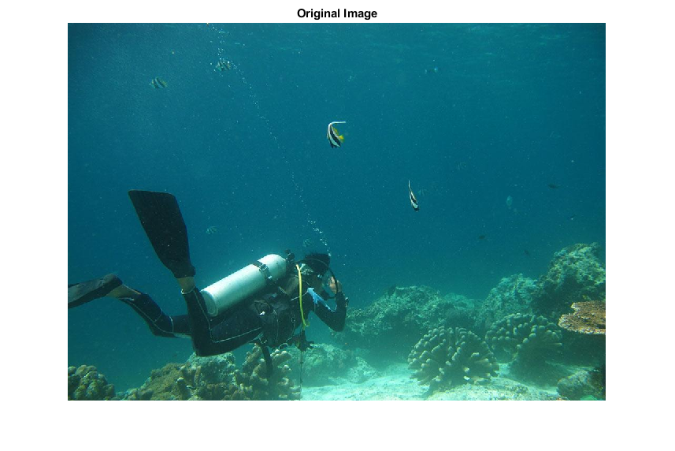
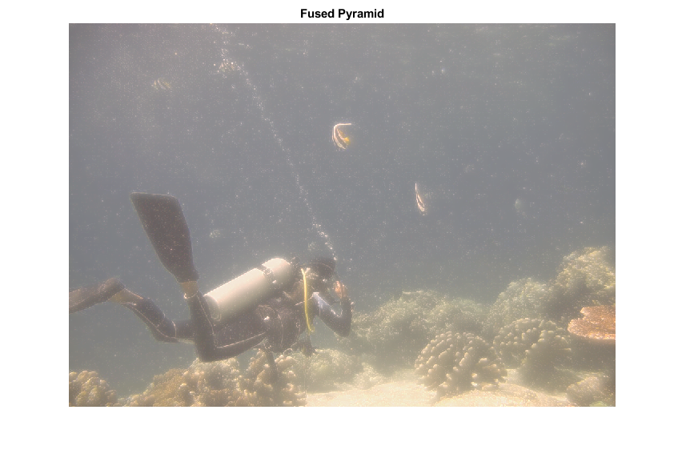

# Underwater Image Enhancement
Table of Contents
- [Intro](#introduction)
- [Applications](#applications)
- [Method](#method)
  - [White Balancing](#white-balancing)
- [Example](#example)
- [References](#references)

# Introduction
The quality of the images taken under water may degrade due to factors such as medium scattering and absorption. The absorption substantially reduces the light energy, while the scattering causes changes in the light propagation direction. This degradation may cause the image to have low contrast or to contain a layer of fog. This repository provides a MATLAB implementation of a method to reduce the aforementioned negative effects and produce better versions of the underwater images. The method was introduced by Ancuti et al. [1].

# Applications

One may ask "Why would we even bother to enhance underwater images?". The answer is that those images can help us identify the objects existing under the water. For instance, we can detect if a cable exists somewhere and examine other underwater infrastructure. Also, knowledge of the underwater objects may be useful for marine biologists and archaeologists.

# Method

test

## White-Balancing

test

$$I_{rc}(x)=I_r(x)+\alpha(\bar{I}_g-\bar{I}_r)(1-I_r(x))I_g(x)$$

# Example

Original Image             |  Enhanced Image
:-------------------------:|:-------------------------:
  |  

# References
1. Ancuti, C. O., Ancuti, C., De Vleeschouwer, C., & Bekaert, P. (2017). Color balance and fusion for underwater image enhancement. IEEE Transactions on image processing, 27(1), 379-393.
