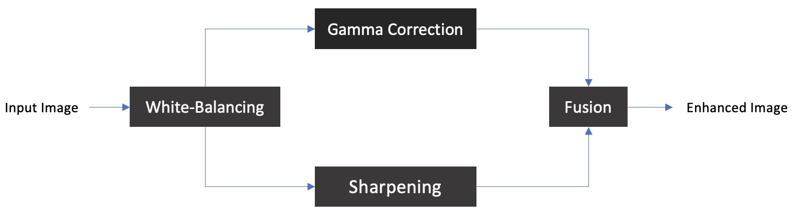

# Underwater Image Enhancement
Table of Contents
- [Intro](#introduction)
- [Applications](#applications)
- [Method](#method)
  - [White Balancing](#white-balancing)
  - [Gamma Correction](#gamma-correction)
  - [Sharpening](#sharpening)
  - [Fusion](#fusion)
- [Example](#example)
- [References](#references)

# Introduction
The quality of the images taken under water may degrade due to factors such as medium scattering and absorption. The absorption substantially reduces the light energy, while the scattering causes changes in the light propagation direction. This degradation may cause the image to have low contrast or to contain a layer of fog. This repository provides a MATLAB implementation of a method to reduce the aforementioned negative effects and produce better versions of the underwater images. The method was introduced by Ancuti et al. [1].

# Applications

One may ask "Why would we even bother to enhance underwater images?". The answer is that those images can help us identify the objects existing under the water. For instance, we can detect if a cable exists somewhere and examine other underwater infrastructure. Also, knowledge of the underwater objects may be useful for marine biologists and archaeologists.

[Back to Top](#)

# Method

## White-Balancing

To compensate for the changes in the light propagation direction caused by medium scattering, which is visible as some kind of shades of unwanted colors on an image taken under water, we apply white-balancing to the image. We chose the Gray-World Algorithm to reach this goal. This algorithm was designed based on the assumption that the color in each sensor channel averages to gray over the entire image. The formula for applying the algorithm to a given image in our case simplifies to:

$$I_{rc}(x)=I_r(x)+\alpha(\bar{I}_g-\bar{I}_r)(1-I_r(x))I_g(x)$$

where $x$ is the position of a pixel, $I_{rc}$ is the new (corrected) intensity level of that pixel corresponding to the red channel, $I_r$ and $I_g$ correspond to the red and green color channels of the image $I$. Note that the image should be normalized so that the intensity levels in each channel belong to the $[0,1]$ interval. Also, $\bar{I}_g$ and $\bar{I}_r$ represent the average intensity level of the green and red channels, respectively. The above formula was designed based on the following obversations:
1. The situation under the water does not have much effect on the green channel.
2. Based on the "Opponent Color Theory" which states that green and red are opponent colors, the green channel can be used to compensate for the distortions made to the red channel.
3. According to the Gray-World Theory, the amount of the green channel's contribution to the red channel's compensation should be proportional to the difference of red and green average intensity levels.
4. The compensation process for the red channel should only be applied to the highly distorted regions.

## Gamma Correction

## Sharpening

## Fusion

[Back to Top](#)

# Example

Original Image             |  Enhanced Image
:-------------------------:|:-------------------------:
  |  

# References
1. Ancuti, C. O., Ancuti, C., De Vleeschouwer, C., & Bekaert, P. (2017). Color balance and fusion for underwater image enhancement. IEEE Transactions on image processing, 27(1), 379-393.

[Back to Top](#)
